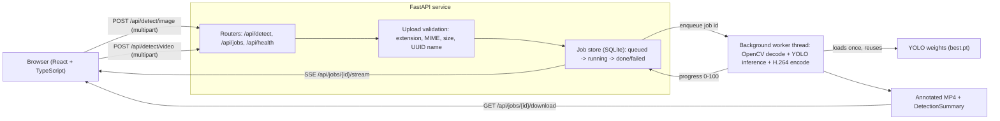

# Fire and Smoke Detection with YOLO

Detect fire and smoke in still images and video with a YOLO object detector, a
FastAPI inference service and a React front end. Upload a clip in the browser,
watch annotation progress stream back frame by frame, then play the original and
the annotated H.264 MP4 side by side, jump through a per-class detection timeline,
and download the result.

The detector is trained on the Kaggle dataset
[sayedgamal99/smoke-fire-detection-yolo](https://www.kaggle.com/datasets/sayedgamal99/smoke-fire-detection-yolo)
(D-Fire images in YOLO format, classes `smoke` and `fire`).


---

## Features

- **Two-class detector** trained on a D-Fire style dataset: `smoke` (class 0) and `fire` (class 1).
- **Still-image endpoint** that returns JSON detections *and* an annotated preview in one response.
- **Asynchronous video pipeline**: uploads return `202` with a job id, annotation runs off the
  event loop, and the annotated MP4 is served when it is ready.
- **Browser-playable output**: annotated clips are encoded as H.264 (`libx264`, `yuv420p`,
  `+faststart`) through the static ffmpeg binary shipped by `imageio-ffmpeg`, so they play inline in
  Chrome, Edge, Firefox and Safari on Windows, macOS and Linux without a system ffmpeg install.
- **Side-by-side review**: the uploaded original and the annotated result play next to each other,
  kept in sync, with a clickable fire/smoke timeline that seeks both players.
- **Detection summary**: frames with fire, frames with smoke, first-seen timestamp per class, peak
  confidence and a per-frame detection list.
- **Live progress over Server-Sent Events**, with automatic polling fallback in the browser.
- **SQLite-backed job store** with `queued / running / done / failed` states, progress, result
  paths, error text and a retention sweep that deletes expired jobs and their files.
- **Per-class overlays**: distinct colours for fire and smoke, a label and a confidence bar per box.
- **Strict upload validation**: extension allowlist, content-type check, size cap, UUID filenames,
  and client filenames that are sanitised rather than trusted.
- **Honest degraded mode**: with no trained weights the API answers `503`
  *"no weights found - train first or set MODEL_PATH"* and the UI shows a banner instead of crashing.
- **Reproducible training scripts**: dataset validation, training, evaluation and export, all driven
  by `argparse` and YAML hyper-parameter files.

## Tech stack

| Layer | Choice |
| --- | --- |
| Detector | Ultralytics YOLO11 / YOLOv8 (PyTorch) |
| API | FastAPI, pydantic v2, pydantic-settings, uvicorn |
| Media | OpenCV (`opencv-python-headless`) for decoding and drawing; ffmpeg via `imageio-ffmpeg` for H.264 encoding |
| Job store | SQLite via the standard library `sqlite3`, guarded by a process lock |
| Frontend | React 19, TypeScript 7 (`strict: true`), Vite 8, Vitest + Testing Library, hand-written CSS |
| Packaging | pip (`requirements.txt` + `pyproject.toml`), npm (`package.json`), Docker Compose |

## Architecture



Still images are handled synchronously inside the request (decode, infer, annotate, base64) because
a single frame is fast. Video is queued: the request returns immediately, a background thread runs
OpenCV and the detector, and the browser follows along over SSE.

## Project structure

```text
fire-smoke-detection-yolo/
├── backend/
│   ├── app/
│   │   ├── __init__.py
│   │   ├── config.py              # pydantic-settings Settings + path resolution
│   │   ├── errors.py              # typed ApiError hierarchy -> HTTP statuses
│   │   ├── main.py                # app factory, CORS, lifespan, exception handlers
│   │   ├── schemas.py             # pydantic request/response models
│   │   ├── uploads.py             # multipart validation and safe storage
│   │   ├── routers/
│   │   │   ├── detect.py          # POST /api/detect/image, /api/detect/video
│   │   │   ├── health.py          # GET  /api/health
│   │   │   └── jobs.py            # job status, SSE stream, download, delete
│   │   └── services/
│   │       ├── detector.py        # lazy YOLO singleton, detect_image / detect_frame
│   │       ├── encoder.py         # H.264 MP4 writer (imageio-ffmpeg) with mp4v fallback
│   │       ├── jobs.py            # SQLite job store + background video worker
│   │       └── video.py           # OpenCV pipeline, overlays, summary builder
│   ├── tests/
│   │   ├── conftest.py            # stub detector, temp settings, TestClient fixtures
│   │   ├── test_detect.py         # upload rejection paths and image detection
│   │   ├── test_health.py         # health with and without weights
│   │   ├── test_jobs.py           # job lifecycle, SSE, download, cleanup
│   │   ├── test_pipeline.py       # real decode -> annotate -> H.264 encode, end-to-end upload
│   │   └── test_video.py          # drawing helpers
│   ├── .env.example
│   ├── Dockerfile
│   ├── pyproject.toml
│   ├── requirements.txt
│   └── requirements-dev.txt
├── frontend/
│   ├── src/
│   │   ├── api/client.ts          # typed fetch wrapper + EventSource subscription
│   │   ├── components/            # Header, UploadDropzone, ProgressBar, JobStatusCard,
│   │   │                          # VideoComparison, DetectionTimeline, DetectionSummary,
│   │   │                          # ImageDetect, ErrorBanner (+ *.test.tsx next to them)
│   │   ├── hooks/useJobProgress.ts# SSE subscription with polling fallback
│   │   ├── test/                  # Vitest setup and fixtures
│   │   ├── App.tsx
│   │   ├── main.tsx
│   │   ├── styles.css             # design tokens, dark-friendly
│   │   ├── types.ts               # mirrors backend/app/schemas.py
│   │   └── vite-env.d.ts
│   ├── .env.example
│   ├── Dockerfile
│   ├── index.html
│   ├── nginx.conf
│   ├── package.json
│   ├── package-lock.json
│   ├── tsconfig.json
│   ├── tsconfig.node.json
│   └── vite.config.ts
├── training/
│   ├── configs/
│   │   ├── yolo11n.yaml           # nano hyper-parameters
│   │   └── yolo11s.yaml           # small hyper-parameters
│   ├── prepare_data.py            # validate dataset, generate data.yaml, class histogram
│   ├── train.py                   # Ultralytics training wrapper
│   ├── validate.py                # model.val() -> reports/metrics.json
│   ├── export.py                  # ONNX / TensorRT / TorchScript / OpenVINO export
│   └── README.md
├── docs/images/                   # screenshots referenced below
├── reports/                       # metrics.json written by training/validate.py
├── samples/                       # fire_sample.jpg, smoke_sample.jpg, sample_clip.mp4 (< 1 MB)
├── docker-compose.yml
├── .editorconfig
├── .gitignore
├── LICENSE
└── README.md
```

## Prerequisites

- Python 3.10 or newer (3.11 recommended).
- Node.js 20.19+ or 22.12+ (required by Vite 8) and npm 10+.
- Roughly 6 GB of free disk for the PyTorch wheels, the dataset and training runs.
- Optional: an NVIDIA GPU with a recent driver. Training on CPU works but is slow.
- Optional: Docker 24+ with Compose v2 if you prefer containers.

### Dataset

The detector is trained on a D-Fire style dataset in YOLO format:

```text
_datasets/smoke_fire_detection/
├── data.yaml                      # shipped file: unusable path, see the note below
└── data/
    ├── train/{images,labels}/     # 14,122 images
    ├── val/{images,labels}/       #  3,099 images
    └── test/{images,labels}/      #  4,306 images
```

Download it from Kaggle
([sayedgamal99/smoke-fire-detection-yolo](https://www.kaggle.com/datasets/sayedgamal99/smoke-fire-detection-yolo),
about 3 GB, 21,527 images) and extract it so that `data.yaml` and `data/` sit directly inside the
dataset folder. A typical Windows layout keeps all datasets next to the repositories:

```text
D:\sample_projects\
├── _datasets\smoke_fire_detection\   <- data.yaml + data\{train,val,test}\{images,labels}
└── fire-smoke-detection-yolo\         <- this repository
```

With that layout the default `--data-dir ../_datasets/smoke_fire_detection` works as is; any other
location can be passed explicitly, e.g. `--data-dir D:\sample_projects\_datasets\smoke_fire_detection`.

Labels are standard YOLO text files, one box per line, `class cx cy w h` with normalised
coordinates. Many files are intentionally empty: those images are negatives (background) and YOLO
uses them to reduce false positives.

> **Note on the shipped `data.yaml`.** Its `path:` key points at `/kaggle/working/D Fire Dataset`,
> an absolute path from the machine that exported the dataset. Ultralytics resolves `train`, `val`
> and `test` relative to that key, so training against the shipped file fails everywhere else.
> `training/prepare_data.py` regenerates a correct descriptor from `DATA_DIR` (and `train.py` calls
> it automatically), so the shipped file is never used.

By default the repository expects the dataset next to itself at
`../_datasets/smoke_fire_detection` (resolved from the repository root); override with the
`DATA_DIR` environment variable or `--data-dir`.

Two frames from the training split (`samples/fire_sample.jpg`, `samples/smoke_sample.jpg`) and a
12-second, 640x360 H.264 clip stitched from dataset frames (`samples/sample_clip.mp4`) are checked
in so the UI can be tried without the full dataset.

## Installation

Clone the repository, then set up the two halves separately.

### Backend

Windows (PowerShell or cmd):

```bat
cd backend
python -m venv .venv
.venv\Scripts\activate
python -m pip install --upgrade pip
pip install -r requirements.txt
copy .env.example .env
```

macOS and Linux:

```bash
cd backend
python3 -m venv .venv
source .venv/bin/activate
python -m pip install --upgrade pip
pip install -r requirements.txt
cp .env.example .env
```

`requirements.txt` includes `imageio-ffmpeg`, which downloads a static ffmpeg build inside the
wheel; nothing else is needed for H.264 output on Windows, macOS or Linux. To use your own ffmpeg
binary instead, set `IMAGEIO_FFMPEG_EXE` to its full path.

For a CPU-only install (much smaller than the default CUDA wheels), install torch first:

```bash
pip install torch torchvision --index-url https://download.pytorch.org/whl/cpu
pip install -r requirements.txt
```

Start the API (from `backend/`):

```bash
uvicorn app.main:app --reload --port 8000
```

### Model weights

The API loads `runs/detect/fire_smoke/weights/best.pt` **relative to the repository root**, which is
exactly where `python training/train.py` writes it. To use weights from elsewhere (for example a
`best.pt` trained on a Kaggle or Colab GPU), either copy the file to that path or set `MODEL_PATH`
in `backend/.env` to an absolute path:

```text
fire-smoke-detection-yolo/
└── runs/detect/fire_smoke/weights/best.pt   <- default MODEL_PATH (git-ignored)
```

Weights are never committed (`*.pt` and `runs/` are in `.gitignore`). If the file is missing the
API still starts: `/api/health` reports `"status": "degraded"` with
`"detail": "no weights found - train first or set MODEL_PATH"`, detection endpoints answer `503`,
and the UI shows a banner with the same instructions.

Interactive documentation is then at <http://127.0.0.1:8000/docs>.

### Frontend

```bash
cd frontend
npm install
copy .env.example .env.local      # Windows
cp .env.example .env.local        # macOS and Linux
npm run dev
```

Vite serves the UI on <http://localhost:5173> and proxies `/api`, `/docs` and `/openapi.json` to
`http://127.0.0.1:8000`, so no CORS configuration is needed in development.

### Docker Compose

```bash
docker compose up --build
```

The UI is then on <http://localhost:8080> and the API on <http://localhost:8000>. The compose file
mounts `./runs/detect/fire_smoke/weights` read-only at `/models`, so train first (or copy your
`best.pt` there); the backend image pins a CPU build of torch.

## Configuration

### Backend (`backend/.env`)

| Variable | Description | Default |
| --- | --- | --- |
| `MODEL_PATH` | Trained weights; relative paths resolve from the repository root. | `runs/detect/fire_smoke/weights/best.pt` |
| `ALLOW_COCO_FALLBACK` | Load a pretrained COCO checkpoint when `MODEL_PATH` is missing. | `false` |
| `COCO_FALLBACK_WEIGHTS` | Checkpoint used for that fallback. | `yolo11n.pt` |
| `DEVICE` | Torch device: empty for auto, or `cpu`, `0`, `0,1`. | *(empty)* |
| `CONF_THRESHOLD` | Default confidence threshold. | `0.35` |
| `IOU_THRESHOLD` | Default NMS IoU threshold. | `0.50` |
| `UPLOAD_DIR` | Where uploads are staged before processing. | `backend/uploads` |
| `OUTPUT_DIR` | Where annotated MP4s are written. | `backend/outputs` |
| `JOB_DB_PATH` | SQLite file holding job state. | `backend/jobs.sqlite3` |
| `MAX_UPLOAD_MB` | Hard upload size cap, in megabytes. | `100` |
| `ALLOWED_IMAGE_EXTENSIONS` | Comma-separated image allowlist. | `.jpg,.jpeg,.png,.bmp,.webp` |
| `ALLOWED_VIDEO_EXTENSIONS` | Comma-separated video allowlist. | `.mp4,.mov,.avi,.mkv,.webm` |
| `FRAME_STRIDE` | Run detection on every Nth frame. | `3` |
| `MAX_VIDEO_FRAMES` | Safety cap on frames processed per job. | `18000` |
| `JOB_RETENTION_HOURS` | How long finished jobs and their files are kept. | `24` |
| `CORS_ORIGINS` | Comma-separated allowed origins. | `http://localhost:5173,http://127.0.0.1:5173` |
| `LOG_LEVEL` | Python logging level. | `INFO` |

### Frontend (`frontend/.env.local`)

| Variable | Description | Default |
| --- | --- | --- |
| `VITE_API_BASE_URL` | Base URL of the API. Empty means same origin (dev proxy or nginx). | *(empty)* |
| `VITE_DEV_PROXY_TARGET` | Where the Vite dev server forwards `/api`. | `http://127.0.0.1:8000` |

## Usage

1. Start the backend and the frontend (or `docker compose up`).
2. Open the UI. The header pill shows whether a model is loaded.
3. **Video tab** - drop a video (`.mp4`, `.mov`, `.avi`, `.mkv`, `.webm`; `samples/sample_clip.mp4`
   is a good first try). The upload returns a job id and the progress bar follows the SSE stream.
   When the job finishes you get:
   - the original and the annotated clip **side by side** (the original follows the annotated
     player's play, pause and seek; containers browsers cannot preview, such as AVI, show a note),
   - a **detection timeline** with one track per class; click a marker to jump both players there,
   - a **summary**: frames analysed, frames with fire, frames with smoke, first-seen time per class,
     peak confidence, and a per-frame list whose timestamps are also seek links,
   - a **Download MP4** button.
4. **Image tab** - drop a JPEG or PNG. Detection runs immediately and returns the annotated preview,
   a per-class count and a table of boxes (`samples/fire_sample.jpg`, `samples/smoke_sample.jpg`).

Without trained weights, every detection call answers `503 model_unavailable` with the message
*"no weights found - train first or set MODEL_PATH"*, and the UI renders a banner explaining how to
fix it. To exercise the plumbing before training, set `ALLOW_COCO_FALLBACK=true`: the service then
loads a pretrained COCO checkpoint, which detects people and cars but **never fire or smoke**. The
UI shows a second banner while that fallback is active.

## API reference

All endpoints are prefixed with `/api`. Errors share one envelope:
`{"error": "<code>", "message": "<human readable>", "detail": {...}}`.

| Method | Path | Description |
| --- | --- | --- |
| `GET` | `/api/health` | Service status, loaded model, source, device and class names. |
| `POST` | `/api/detect/image` | Multipart image upload; returns detections and an annotated preview. |
| `POST` | `/api/detect/video` | Multipart video upload; returns `202` with a job id. |
| `GET` | `/api/jobs` | List recent jobs (`?limit=20`). |
| `GET` | `/api/jobs/{job_id}` | Job state, progress, error and summary. |
| `GET` | `/api/jobs/{job_id}/stream` | Server-Sent Events progress stream (`progress`, `done`, `failed`). |
| `GET` | `/api/jobs/{job_id}/download` | Annotated H.264 MP4; supports HTTP `Range` so `<video>` can seek. |
| `DELETE` | `/api/jobs/{job_id}` | Delete a job together with its upload and output. |

Status codes used: `400` invalid upload, `404` unknown job, `409` job not finished, `410` result
cleaned up, `413` upload too large, `422` undecodable media or failed validation, `503` no model.

### Health

```bash
curl http://127.0.0.1:8000/api/health
```

```json
{
  "status": "ok",
  "version": "0.1.0",
  "model_loaded": true,
  "model_path": "D:\\sample_projects\\fire-smoke-detection-yolo\\runs\\detect\\fire_smoke\\weights\\best.pt",
  "model_source": "trained",
  "device": "auto",
  "class_names": ["smoke", "fire"],
  "detail": null
}
```

### Detect in an image

```bash
curl -X POST http://127.0.0.1:8000/api/detect/image \
  -F "file=@samples/fire_sample.jpg" \
  -F "conf=0.3"
```

```json
{
  "filename": "fire_sample.jpg",
  "width": 640,
  "height": 480,
  "detections": [
    { "class_id": 1, "class_name": "fire", "confidence": 0.87, "xyxy": [118.4, 264.9, 205.1, 337.6] },
    { "class_id": 0, "class_name": "smoke", "confidence": 0.41, "xyxy": [96.0, 180.3, 288.7, 300.2] }
  ],
  "class_counts": { "fire": 1, "smoke": 1 },
  "conf_threshold": 0.3,
  "iou_threshold": 0.5,
  "inference_ms": 61.2,
  "annotated_image": "data:image/jpeg;base64,/9j/4AAQSkZJRgABAQ..."
}
```

Confidence values above are illustrative, not measured.

### Queue a video

```bash
curl -i -X POST http://127.0.0.1:8000/api/detect/video \
  -F "file=@clip.mp4"
```

```http
HTTP/1.1 202 Accepted
content-type: application/json
```

```json
{
  "job_id": "9f1c0a5a3b7e4d0a9c2f6b81d4e5a7c3",
  "state": "queued",
  "kind": "video",
  "filename": "clip.mp4",
  "created_at": "2026-01-14T09:31:02.481Z",
  "status_url": "/api/jobs/9f1c0a5a3b7e4d0a9c2f6b81d4e5a7c3",
  "stream_url": "/api/jobs/9f1c0a5a3b7e4d0a9c2f6b81d4e5a7c3/stream"
}
```

### Poll a job

```bash
curl http://127.0.0.1:8000/api/jobs/9f1c0a5a3b7e4d0a9c2f6b81d4e5a7c3
```

```json
{
  "job_id": "9f1c0a5a3b7e4d0a9c2f6b81d4e5a7c3",
  "kind": "video",
  "state": "done",
  "progress": 100.0,
  "message": "complete",
  "error": null,
  "filename": "clip.mp4",
  "created_at": "2026-01-14T09:31:02.481Z",
  "updated_at": "2026-01-14T09:32:44.903Z",
  "expires_at": "2026-01-15T09:31:02.481Z",
  "download_url": "/api/jobs/9f1c0a5a3b7e4d0a9c2f6b81d4e5a7c3/download",
  "summary": {
    "total_frames": 1800,
    "processed_frames": 600,
    "frames_with_detections": 214,
    "frames_with_fire": 180,
    "frames_with_smoke": 96,
    "total_detections": 331,
    "peak_confidence": 0.93,
    "peak_confidence_class": "fire",
    "first_detection_seconds": 4.2,
    "fps": 30.0,
    "width": 1280,
    "height": 720,
    "duration_seconds": 60.0,
    "frame_stride": 3,
    "per_class": [
      { "class_name": "fire", "frames": 180, "detections": 205, "peak_confidence": 0.93, "first_seen_seconds": 4.2 },
      { "class_name": "smoke", "frames": 96, "detections": 126, "peak_confidence": 0.71, "first_seen_seconds": 3.1 }
    ],
    "timeline": [],
    "timeline_truncated": false,
    "codec": "h264"
  }
}
```

The numbers above are an illustrative payload shape, not a benchmark.

### Follow progress and download

```bash
curl -N http://127.0.0.1:8000/api/jobs/9f1c.../stream
```

```text
event: progress
data: {"job_id":"9f1c...","state":"running","progress":42.0,"message":"annotating frame 756 of 1800", ...}

event: done
data: {"job_id":"9f1c...","state":"done","progress":100.0,"message":"complete", ...}
```

```bash
curl -OJ http://127.0.0.1:8000/api/jobs/9f1c.../download
curl -X DELETE http://127.0.0.1:8000/api/jobs/9f1c...
```

## Training

Run every command from the repository root with the backend virtual environment active (the
training scripts only need `ultralytics`, which `backend/requirements.txt` installs). Relative
paths such as `--data-dir`, `--project` and `--weights` are resolved against the repository root,
so the commands also work from other directories.

### 1. Validate the dataset and generate `data.yaml`

```bash
python training/prepare_data.py --data-dir ../_datasets/smoke_fire_detection
```

Windows, with the dataset at `D:\sample_projects\_datasets\smoke_fire_detection`:

```bat
python training\prepare_data.py --data-dir D:\sample_projects\_datasets\smoke_fire_detection
```

This writes `training/data.generated.yaml` with an absolute, machine-local `path`, checks that each
split has matching image and label counts, and prints a class-frequency histogram parsed from the
label files. Add `--strict` to fail on any inconsistency. The first pass reads ~21,500 label files,
which takes a while on a network or virtualised drive; on a local SSD it is a few seconds.

### 2. Train

`train.py` regenerates the descriptor automatically when it is missing or points at a different
`--data-dir`, so step 1 is optional once you trust the dataset.

**Full dataset on a GPU (recommended).** On one NVIDIA GPU with 8 GB+ of memory:

```bash
python training/train.py --model yolo11n --epochs 100 --imgsz 640 --batch 32 --device 0 --workers 8
```

```bat
:: Windows, dataset outside the default location
python training\train.py --data-dir D:\sample_projects\_datasets\smoke_fire_detection ^
    --model yolo11s --config training\configs\yolo11s.yaml --device 0 --workers 4
```

Install a CUDA build of torch first (`pip install torch torchvision --index-url
https://download.pytorch.org/whl/cu128`, matching your driver) and check it with
`python -c "import torch; print(torch.cuda.is_available())"`. `--batch -1` lets Ultralytics pick the
largest batch that fits in GPU memory. On Windows keep `--workers` at 4 or lower if the dataloader
stalls. Resume an interrupted run with `python training/train.py --resume --name fire_smoke`.

**Quick CPU smoke test.** To check the whole pipeline end to end without a GPU (the weights will be
useless, but `best.pt` is produced and the API can load it):

```bash
python training/train.py --epochs 2 --imgsz 160 --batch 16 --workers 1 --device cpu
```

On a 2-core CPU this took about 20 seconds against a 120/40/20-image subset of the dataset; the
full 14k-image training split needs a GPU.

Keys in a `--config` YAML take precedence over the equivalent command-line flags.

Useful flags: `--model {yolo11n,yolo11s,yolo11m,yolov8n,yolov8s,yolov8m}`, `--patience` (early
stopping, default 25 epochs), `--project`/`--name` (artefact location), `--scratch` (skip the COCO
initialisation), `--workers`, `--seed`. Weights land in `runs/detect/<name>/weights/best.pt`; point
`MODEL_PATH` at that file and restart the API.

Class imbalance is real in this dataset - smoke boxes dominate fire boxes, and a large share of
images are negatives. The histogram printed in step 1 is the cheapest way to see it before you
commit GPU hours.

### 3. Evaluate

```bash
python training/validate.py --weights runs/detect/fire_smoke/weights/best.pt --split test
```

Writes `reports/metrics.json` (git-ignored) with overall and per-class precision, recall, mAP@50 and mAP@50-95,
alongside the weights, split and thresholds used. **This repository ships no measured metrics**:
any number you see in an example payload is a placeholder for the shape of the data, never a
reported result. Ultralytics' own plots and per-image outputs go to `runs/detect/val_<split>/`.
Fill the table below from your own run.

| Model | Image size | Epochs | mAP@50 | mAP@50-95 | Notes |
| --- | --- | --- | --- | --- | --- |
| yolo11n | 640 | *TBD* | *placeholder - run validate.py* | *placeholder* | baseline |
| yolo11s | 768 | *TBD* | *placeholder - run validate.py* | *placeholder* | slower, better recall |

### 4. Export (optional)

```bash
pip install onnx onnxruntime onnxslim
python training/export.py --weights runs/detect/fire_smoke/weights/best.pt --format onnx --simplify
python training/export.py --weights runs/detect/fire_smoke/weights/best.pt --format torchscript
python training/export.py --weights runs/detect/fire_smoke/weights/best.pt --format engine --device 0
```

Missing export backends are reported as a single actionable line (for example "pip install onnx
onnxruntime onnxslim") instead of a traceback.

## Screenshots

Add your own captures to `docs/images/` and they will render here.

| View | File | Description |
| --- | --- | --- |
| Video job in progress | `docs/images/video-progress.png` | Upload, progress bar and live SSE updates. |
| Annotated result | `docs/images/video-result.png` | Side-by-side players, timeline and detection summary. |
| Image detection | `docs/images/image-detection.png` | Annotated preview and per-box table. |

<!--  -->
<!--  -->
<!--  -->

## Testing

```bash
cd backend
pip install -r requirements-dev.txt
pytest                      # unit and API tests, no model weights required
ruff check app tests        # lint
mypy app                    # static types
```

The suite (32 tests) injects a stub detector, so nothing downloads weights or touches the GPU. It
covers the health endpoint in both states, every upload rejection path (wrong extension, wrong
content type, empty body, oversized body, undecodable image, out-of-range threshold), the `503`
no-weights path for images and videos, the full video job lifecycle including SSE and ranged
download, the drawing helpers, and a real decode -> annotate -> encode run that asserts the output
stream is H.264.

Frontend:

```bash
cd frontend
npm test                    # Vitest + Testing Library (jsdom)
npm run typecheck
npm run build
```

## Roadmap

- Multi-worker deployment: replace the in-process job store with Redis or RQ so several uvicorn
  workers can share state.
- Simple temporal smoothing (require N consecutive sampled detections) to suppress flicker.
- Tracking (ByteTrack/BoT-SORT) so a fire is counted as one event rather than per-frame boxes.
- Alerting hooks: webhook or email when a clip crosses a confidence and duration threshold.
- RTSP / webcam ingestion for continuous monitoring.
- Quantised ONNX or TensorRT inference path for edge devices.

## Limitations

- **No metrics are claimed here.** Nothing in this repository has been benchmarked; every number in
  the examples is illustrative. Run `training/validate.py` for real figures on your split.
- The job store is per process. Running uvicorn with `--workers > 1` gives each worker its own
  detector and, unless `JOB_DB_PATH` is shared, its own view of the jobs.
- Video is decoded with OpenCV and re-encoded to H.264 without the audio track. If
  `imageio-ffmpeg` is missing the service falls back to OpenCV's `mp4v` writer, which browsers
  cannot play; the job summary then reports `"codec": "mp4v"` and the UI tells you to install it.
  Containers OpenCV cannot open surface as a `422` with a clear message.
- Detection runs every `FRAME_STRIDE` frames; skipped frames reuse the previous boxes, so overlays
  can lag fast motion by up to `FRAME_STRIDE - 1` frames. Per-class frame counts are computed over
  sampled frames, not over all frames.
- Smoke is inherently low contrast and easily confused with fog, cloud and steam; fire is confused
  with sunsets, brake lights and reflections. Treat detections as decision support, never as a
  replacement for a certified fire-detection system.
- Uploads are stored on local disk and processed in-process. This is a demonstration service, not a
  hardened multi-tenant deployment: no authentication, no rate limiting, no virus scanning.

## License

MIT. See [LICENSE](LICENSE).

The dataset is not covered by this licence; check the terms of the D-Fire dataset before
redistributing images, labels or trained weights derived from them.
